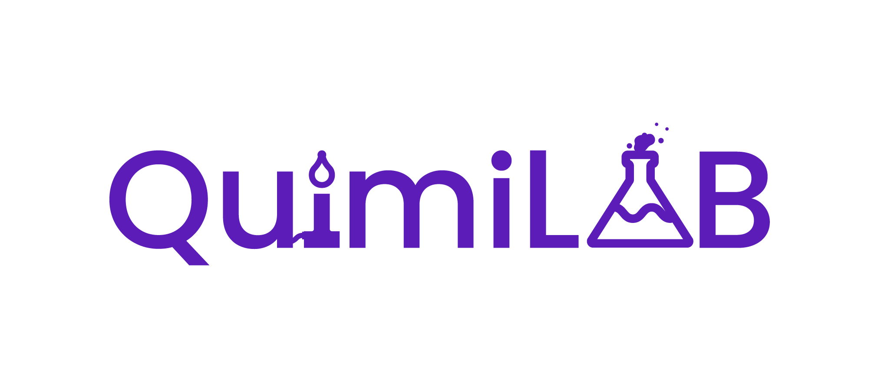
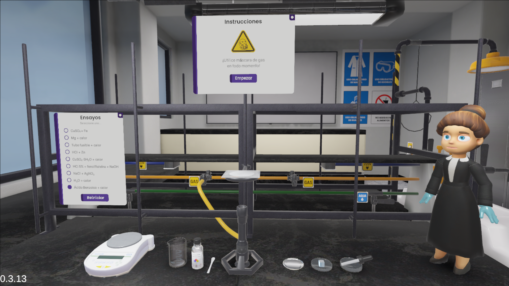

  

# QuimiLab-PhysicalChemicalChanges

Virtual chemistry laboratory for interactive experimental practices developed at the Universidad Central del Ecuador.

---

## Overview

QuimiLab is an interactive virtual chemistry laboratory designed to support experimental practices through three-dimensional simulation.

The prototype reproduces a laboratory environment and experimental procedures using Unity and WebGL technologies, providing a browser-based virtual environment for chemistry education and research.

The current prototype implements the institutional laboratory practice **Physical and Chemical Changes**, comprising nine experimental trials involving physical and chemical phenomena.

  

This repository contains the research prototype presented in the paper:

**Development and Preliminary Evaluation of a Virtual Prototype for Physical and Chemical Changes Laboratory Practice**

---

## Repository Structure

| Folder | Description |
|---------|-------------|
| `Prototype` | Executable WebGL prototype and local deployment resources |
| `Demo` | Short demonstration video of the prototype |
| `Screenshots` | Visual documentation of the virtual laboratory, interfaces, equipment, and experimental interactions |
| `Evaluation` | Evaluation instrument, anonymized response data, statistical analysis script, dependencies, and generated figures |
| `Technical_Documentation` | Supplementary documentation describing the development workflow, software architecture, experimental logic, assets, interaction mechanisms, and deployment |

---

## Running the Prototype

The executable WebGL build is available in the `Prototype` folder.

To run the prototype:

1. Open `HTML5LaunchHelper.exe`.
2. Start the local HTTP server.
3. The prototype will be launched using the default web browser configured on the computer.
4. Wait for the WebGL application to finish loading.

The WebGL application should be executed through the included local HTTP server rather than opening `index.html` directly from the file system.

Detailed execution information is available in:

`Prototype/README.md`

---

## Evaluation Resources

The `Evaluation` folder contains the supplementary materials used in the preliminary perception-based evaluation of the prototype.

These resources include:

- The original evaluation instrument administered through Microsoft Forms.
- Anonymized participant response data.
- The Python script used to reproduce the statistical analyses reported in the manuscript.
- Python dependencies required to execute the analysis.
- Figures generated from the statistical analysis.

The statistical analysis includes descriptive statistics, sample standard deviations, Cronbach's alpha, an exploratory Kruskal--Wallis test, and Spearman's rank correlation.

No names, email addresses, timestamps, open-ended comments, or other direct participant identifiers are included in the published dataset.

Detailed information is available in:

`Evaluation/README.md`

---

## Technical Documentation

Supplementary technical documentation is provided in the `Technical_Documentation` folder.

It includes information about:

- Development environment.
- Development workflow.
- Experimental practice characterization.
- 3D asset development and provenance.
- Software architecture.
- Rule-based experimental logic.
- State transitions and visual responses.
- Implemented experimental trials.
- Interaction mechanisms.
- WebGL deployment.
- Browser execution.
- Hardware considerations.
- Digital accessibility limitations.
- Source code availability.

The documentation also includes the development workflow and software architecture diagrams used to describe the prototype.

---

## Developed With

- Unity 6000.0.48f1
- C#
- Blender 3.6.23
- WebGL

---

## Source Code Availability

The source code of the virtual prototype is not publicly available because the software is part of an ongoing institutional research project at the Universidad Central del Ecuador.

The repository provides the executable WebGL prototype, demonstration materials, screenshots, evaluation instrument, anonymized response data, statistical analysis resources, and supplementary technical documentation to support transparency and verification of the work reported in the manuscript.

---

## Institutional Project

This prototype was developed as part of an ongoing institutional research project at the Universidad Central del Ecuador through the collaborative work of the **Centro de Física** and the **Centro de Química**.

The current objective of the project is to progressively consolidate the virtual laboratory environment within the institutional context and subsequently evaluate its potential adaptation to other educational settings.

---

## Project Team

### Project Director

**MSc. Luis Ramiro Dominguez Leiton**  
Project Director  
Centro de Física  
Universidad Central del Ecuador

### Virtualization Team – Centro de Física

- **Ing. Everzon Feiner Domínguez Castillo**
- **Ing. Felipe Josué Lima Alvear**
- **Ing. Eddy Santiago Sánchez Aguiar**
- **Ing. Daniel Ignacio Ronquillo Lugo**
- **MSc. Daniela Alejandra Tupiza Peralta**
- **MSc. Wladimir Arcesio Vilca Lincango**

### Chemistry Academic Team – Centro de Química

- **MSc. Erika Tatiana Tingo Proaño**
- **MSc. Maribel Araceli Andrango Morales**
- **MSc. María Gabriela Salazar Martínez**
- **Quím. Christian Jesús Rosero Narváez**
- **Quím. Nieves Marcela Tello Larco**

---

## Citation

Publication information will be added after the conference proceedings are published.
