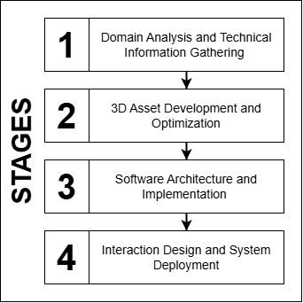
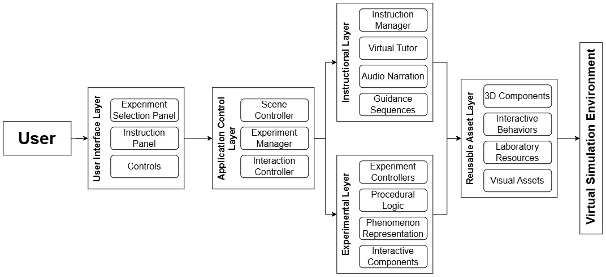

# Technical Overview

This document provides supplementary technical information about the virtual prototype developed for the laboratory practice **Physical and Chemical Changes** at the Universidad Central del Ecuador.

It complements the technical description presented in the paper:

**Development and Preliminary Evaluation of a Virtual Prototype for Physical and Chemical Changes Laboratory Practice**

---

## 1. Development Environment

The prototype was developed using the following technologies:

- Unity 6000.0.48f1
- C#
- Blender 3.6.23
- WebGL

Unity was used to implement the virtual environment, interaction mechanisms, procedural logic, and visual representation of the experimental phenomena.

Blender was used for the development and optimization of the three-dimensional laboratory environment, equipment, materials, and other visual assets.

The final prototype was exported as a WebGL application for execution through a web browser.

---

## 2. Development Workflow

The development process followed four main stages:

1. Domain Analysis and Technical Information Gathering
2. 3D Asset Development and Optimization
3. Software Architecture and Implementation
4. Interaction Design and System Deployment

The process began with the characterization of the real laboratory practice and continued with the creation of the virtual assets, implementation of the software architecture, development of the experimental logic, and deployment of the resulting WebGL prototype.

The following figure summarizes the development workflow used in the project.



**Figure 1.** Development and implementation workflow followed during the construction of the virtual prototype.

---

## 3. Experimental Practice Characterization

The prototype was developed from the institutional laboratory practice **Physical and Chemical Changes**, implemented at the Centro de Química of the Universidad Central del Ecuador.

During the characterization stage, laboratory staff performed the experimental practice and explained:

- The experimental sequence.
- Required laboratory equipment.
- Materials and reagents.
- Manipulation procedures.
- Observable physical and chemical phenomena.
- Expected experimental outcomes.

The development team documented the process using technical observations, photographs, videos, and the institutional laboratory guide.

This information was used as the reference for the subsequent virtualization of the laboratory practice.

---

## 4. 3D Asset Development

All three-dimensional assets included in the prototype were created by the project development team.

No external 3D models were used.

Real laboratory equipment and workbenches at the Centro de Química were directly measured and photographed to reproduce their:

- Dimensions.
- General proportions.
- Visual characteristics.
- Textures.
- Spatial arrangement.

Photographs and videos of the real laboratory were also used as visual references for reconstructing the experimental environment.

To support execution through WebGL, the assets were optimized using techniques including:

- Low-poly modeling.
- UV mapping.
- Texture baking.
- Normal mapping.
- Physically Based Rendering (PBR) materials.

These techniques were used to reduce geometric and computational complexity while preserving the visual characteristics required for recognition and interaction.

---

## 5. Software Architecture

The prototype follows a modular architecture organized into five functional layers:

1. User Interface Layer
2. Application Control Layer
3. Instructional Layer
4. Experimental Layer
5. Reusable Asset Layer

The relationship between these layers is summarized in the following architecture diagram.



**Figure 2.** Layered software architecture of the virtual simulation environment.

### 5.1 User Interface Layer

The User Interface Layer provides the main elements used by the user to interact with the application.

Its responsibilities include:

- Experimental trial selection.
- Procedural instructions.
- Navigation controls.
- Contextual interaction controls.

---

### 5.2 Application Control Layer

The Application Control Layer coordinates the general state of the application.

Its responsibilities include:

- Active scene management.
- Experimental trial selection.
- User interaction coordination.
- Communication between the interface and experimental components.

---

### 5.3 Instructional Layer

The Instructional Layer manages the elements used to guide the user during the experimental procedure.

Its components include:

- Instruction manager.
- Virtual tutor.
- Audio narration.
- Guidance sequences.

The virtual tutor and procedural interfaces provide information about the actions required at each stage of the experimental sequence.

---

### 5.4 Experimental Layer

The Experimental Layer contains the software components responsible for the execution of the experimental activities.

It includes:

- Experiment controllers.
- Procedural logic.
- Interactive components.
- Representation of experimental phenomena.

Each experimental trial contains its own procedural sequence while reusing common software and interaction components when possible.

---

### 5.5 Reusable Asset Layer

The Reusable Asset Layer groups resources that can be shared across different experimental trials.

These include:

- 3D laboratory components.
- Laboratory equipment.
- Interactive behaviors.
- Visual resources.
- Common interaction mechanisms.

This organization was adopted to facilitate the progressive incorporation of additional experimental practices.

---

## 6. Experimental Logic

The experimental activities are implemented through rule-based procedural sequences derived from the documented laboratory protocol.

The prototype does not use a general-purpose chemical reaction engine.

Instead, each experimental trial is represented through predefined states, interaction conditions, and visual responses associated with the corresponding experimental procedure.

### 6.1 Procedural States

Each trial progresses through a predefined sequence of experimental states.

Before enabling an interaction, the system verifies whether the required preceding actions have been completed.

For example, an experimental action may require the user to:

1. Select the corresponding trial.
2. Place the required laboratory equipment.
3. Add or manipulate the required material or reagent.
4. Activate an instrument or heat source.
5. Observe the visual response associated with the resulting state.

If the required previous action has not been completed, the next interaction remains unavailable.

Actions that do not correspond to the active procedural state are therefore prevented.

---

### 6.2 State Transitions

When a valid interaction is performed, the corresponding experiment controller changes the current state of the experimental sequence.

A simplified representation of the logic is:

```text
Current State
     ↓
Check required previous actions
     ↓
Valid interaction?
     ↓
State transition
     ↓
Activate predefined visual response
     ↓
Enable next procedural step
```

The instructional interface is updated according to the current state so that the user receives the next corresponding instruction.

### 6.3 Visual Representation of Experimental Phenomena

Depending on the experimental phenomenon, a valid state transition may activate one or more predefined visual responses, including:

- Animations.
- Material and color changes.
- Particle systems.
- Lighting effects.
- Object activation.
- Object transformation.
- Changes in the visible state of laboratory materials.
- Activation or modification of instrument behavior.

These visual responses are associated with the procedural state of each experimental trial.

For example, when an interaction requires the addition of a reagent associated with an observable color change, the system can replace the initial material properties of the virtual liquid with the predefined material corresponding to the resulting experimental state.

In the acid-base trial involving **HCl, phenolphthalein, and NaOH**, the correct sequence of reagent addition triggers the predefined visual change associated with the corresponding stage of the experimental procedure. This allows the user to observe a visible change in the appearance of the virtual solution once the required procedural conditions have been completed.

Similarly, heating-related trials can activate predefined responses such as:

- Burner ignition.
- Modification of flame intensity.
- Activation of vapor or particle effects.
- Changes in the visual appearance of the material being heated.

For example, when the laboratory burner is activated during a heating procedure, the system changes the burner state from inactive to active and displays the corresponding flame. The user can then modify the flame intensity through the contextual interaction controls. Once the required heating conditions are reached within the procedural sequence, the visual response associated with the experimental phenomenon is activated.

Another example occurs when a physical or chemical process produces a visible modification of a material. In these cases, the corresponding experiment controller activates the predefined material, color, particle, or object-state change associated with that stage of the practice.

These changes are activated only after the required procedural conditions have been satisfied.

The visual effects therefore represent the observable outcomes documented during the characterization of the real laboratory practice rather than results calculated dynamically by a chemical simulation engine.

---

## 7. Implemented Experimental Trials

The current prototype contains nine experimental trials corresponding to the institutional laboratory practice.

| Experimental Trial | Main Observable Phenomenon | Type |
|---|---|---|
| CuSO4 + Fe | Redox reaction | Chemical |
| Mg + Heat | Combustion reaction | Chemical |
| Fuse tube + Heat | Melting | Physical |
| HCl + Zn | Redox reaction | Chemical |
| CuSO4·5H2O + Heat | Dehydration | Chemical |
| HCl + Phenolphthalein + NaOH | Neutralization reaction | Chemical |
| NaCl + AgNO3 | Precipitation reaction | Chemical |
| H2O + Heat | Evaporation | Physical |
| Benzoic acid + Heat | Sublimation | Physical |

Each trial uses the same general procedural architecture while implementing the specific sequence and visual responses required for the corresponding phenomenon.

---

## 8. Interaction Design

The prototype uses a first-person interaction scheme.

The main interaction mechanisms are:

- Keyboard navigation.
- Mouse camera control.
- Contextual controls associated with interactive laboratory elements.

Interactive objects are visually highlighted when they can be selected.

The available controls depend on both the selected object and the current procedural state.

For example, interaction with the laboratory burner provides contextual controls for:

- Ignition.
- Shutdown.
- Flame adjustment.

The interface also includes:

- Experimental trial selection panel.
- Procedural instruction panel.
- Virtual tutor.
- Contextual controls associated with laboratory equipment.

Together, these components guide the user through the actions required for each experimental trial.

---

## 9. WebGL Deployment

The prototype was exported from Unity as a WebGL application.

The executable build is available in the `Prototype` directory of this repository.

The directory contains:

- `Build/`
- `StreamingAssets/`
- `TemplateData/`
- `index.html`
- `HTML5LaunchHelper.exe`

Because the WebGL application should be served through HTTP rather than opened directly from the local file system, a lightweight local HTTP server is included with the prototype.

---

## 10. Browser Execution

The prototype is executed using the **default web browser configured in the operating system**.

When `HTML5LaunchHelper.exe` is started and the local server is activated, the prototype is launched through the browser registered as the default browser on that computer.

During development and the preliminary evaluation at the Centro de Química, the prototype was executed on the standard desktop and laptop computers available at the institution.

Across the computers used during these activities, the browsers configured as default or available in the institutional environment included:

- Google Chrome.
- Microsoft Edge.
- Mozilla Firefox.
- Opera.

These browsers therefore reflect the software environments available on the CQ-UCE computers used during development and evaluation.

The prototype does not require the user to manually select one of these browsers before execution. The local launcher relies on the browser configured as the system default.

Compatibility with every browser, browser version, or operating system configuration has not been formally evaluated.

---

## 11. Hardware Requirements

Formal minimum hardware requirements were not established during the preliminary study.

The prototype was developed and evaluated using the standard desktop and laptop computers available at the Centro de Química of the Universidad Central del Ecuador.

Consequently, no specific minimum requirements for:

- CPU.
- GPU.
- RAM.
- Screen resolution.

are claimed in this repository.

---

## 12. Digital Accessibility

The current interaction scheme relies primarily on keyboard-and-mouse input.

Alternative interaction mechanisms and formal digital accessibility were not evaluated during the preliminary study.

Accessibility therefore remains an area for future evaluation and development.

---

## 13. Source Code Availability

The source code of the virtual prototype is not publicly available because the software is part of an ongoing institutional research project at the Universidad Central del Ecuador.

The repository instead provides:

- Executable WebGL prototype.
- Demonstration video.
- Screenshots.
- Evaluation instrument.
- Anonymized response data.
- Statistical analysis script.
- Reproducible statistical figures.
- Technical documentation.

These materials are provided to support transparency, verification, and reproducibility of the work reported in the manuscript.

---

## 14. Institutional Context

The prototype was developed through collaborative work between:

- Centro de Física, Universidad Central del Ecuador.
- Centro de Química, Universidad Central del Ecuador.

The current objective of the project is to progressively consolidate the virtual laboratory environment within the institutional context before evaluating its potential adaptation to other educational settings.
